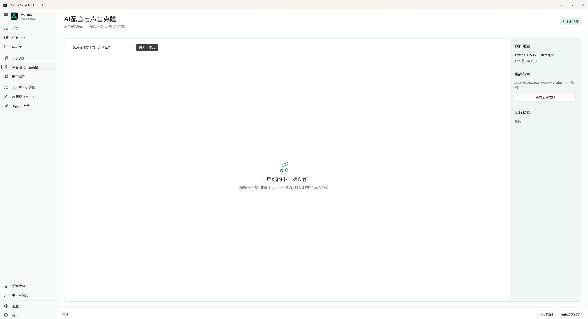
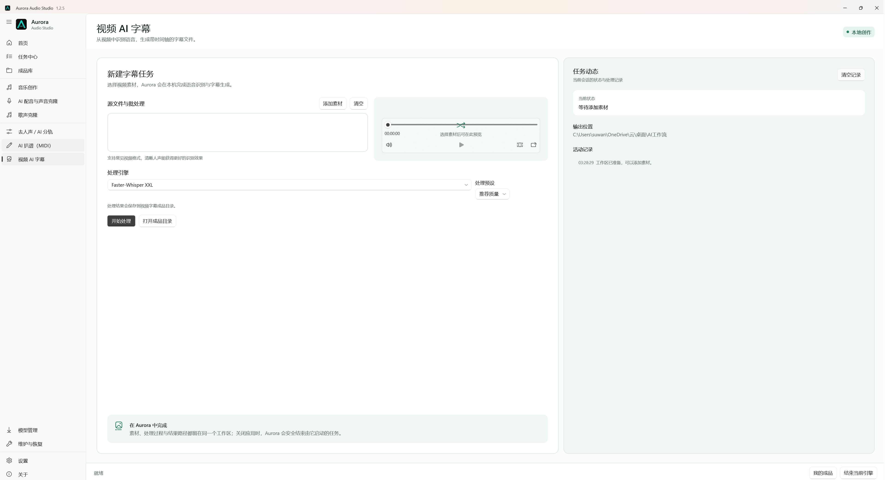

<p align="center">
  
</p>

<h1 align="center">Aurora Audio Studio</h1>

<p align="center">
  让声音创作回到创作本身。<br>
  A local-first Windows studio for AI music, voice, stems, MIDI, and subtitles.
</p>

<p align="center">
  <a href="https://github.com/swy2018/Aurora-Audio-Studio/releases/latest"></a>
  <a href="https://swy2018.github.io/Aurora-Audio-Studio/"></a>
  <a href="LICENSE"></a>
</p>

<p align="center">
  <a href="https://swy2018.github.io/Aurora-Audio-Studio/">官方网站</a> |
  <a href="https://github.com/swy2018/Aurora-Audio-Studio/releases/latest">下载 1.0.1 正式版</a> |
  <a href="CHANGELOG.md">更新记录</a> |
  <a href="#english">English</a>
</p>


## 声音创作需要工作台，不需要更多启动器

Aurora Audio Studio 是面向 Windows 创作者的本地 AI 音频工作台。它把原本分散的模型、环境、运行状态和成品目录整理进同一套原生界面。选择创作引擎后，本地模型工作台会直接显示在 Aurora 中，不必在浏览器、终端和多个启动器之间来回切换。

素材、模型与生成结果仍由你的电脑保存。Aurora 不包含模型权重，也不把创作内容上传到 Aurora 云端；需要什么引擎，由你决定何时安装。

<table>
  <tr>
    <td width="50%"></td>
    <td width="50%"></td>
  </tr>
  <tr>
    <td align="center">声音、配音与歌声</td>
    <td align="center">视频识别与字幕制作</td>
  </tr>
</table>

### 1.0.1：模型需要时，就在工作台入口安装

选择尚未安装的创作模型时，原本灰色的“进入工作台”现在会变成“自动安装模型”。确认窗口会在下载前说明精确安装位置、预计下载量与建议预留空间，也可以改选 Aurora 模型目录；安装完成并通过完整性检查后，会自动继续进入工作台。

自动更新也简化为单一界面：Aurora 仍负责检查版本、断点续传、SHA-256 校验和安装交接，开始覆盖后只保留 Windows 标准安装进度窗口，不再同时显示重复的 Aurora 自制进度窗。

### 1.0.0：可靠更新，正式启程

1.0.0 是 Aurora Audio Studio 的首个正式版。它把本地音乐、配音、歌声、分轨、扒谱、MIDI 与字幕能力集中在同一套 WinUI 3 工作台，同时保留可迁移项目、持久任务中心、模型管理、维护诊断与四语言界面。

更新下载支持断点续传和自动重试。校验完成后，Aurora 专属更新窗口会显示后台安装进度，Inno 安装向导不再出现，只有覆盖安装真正成功后才启动新版。个人设置、项目、模型、成品和用户选择的安装目录都会保留。桌面、任务栏、标题栏与安装器使用版本化图标路径，覆盖更新后不再继续显示旧图缓存。

正式版代码已经完成一次保持功能、界面、交互逻辑与输出不变的精简审计：移除无效事件、重复条件和未启用模板，同时保留断点续传、完整性校验、任务串行化、旧项目兼容与安装交接等必要保护。

### 0.9.8：模型信息更清楚，更新提示真正完整

0.9.8 完整汉化“关于”页面的动态更新结果，能明确区分已是最新版、网络失败、发布资源不完整、校验失败和更新程序已启动。模型中心现在会显示每个组件的用途、语言范围、预计下载量、显存建议、来源、许可、版本与本地路径，并可筛选已安装、默认和可选模型。

字幕工作流新增 Faster-Whisper Small、Large v3 Turbo 与 Large v3 三档可选模型，分别面向轻量运行、速度与准确率平衡以及准确率优先。它们不会自动下载，也不会改变现有默认模型。新项目使用更短的 `.arr` 扩展名，同时继续兼容旧 `.aurora` 文件。应用、任务栏、标题栏、安装程序和网站同步启用新的深色 A-wave 图标。

### 0.9.7：更多选择，仍由你决定安装什么

0.9.7 在不改变现有默认模型套件的前提下，为模型中心增加 Qwen3-TTS 0.6B、F5-TTS、Demucs 4 与 Spotify Basic Pitch。它们全部标记为可选模型，只有在用户主动选择后才会下载和部署；未安装的可选模型不会触发维护警告。

Qwen3-TTS 权重通过 Hugging Face 获取。F5-TTS、Demucs 与 Basic Pitch 使用 uv 创建彼此独立的 Python 3.11 环境，避免污染系统 Python。首页创作入口也改为图标在前的横向布局，左栏底部统一为“模型中心、维护与恢复、设置、关于”。

### 0.9.6：更可靠的安装、升级与卸载

0.9.6 开始规范 Windows 安装生命周期。Aurora 默认安装到 `C:\Program Files\Aurora Audio Studio`，并在升级时保留个人设置、任务记录、模型、项目和成品；1.0.0 已进一步改为同一 AppId 原位覆盖，取消脆弱的前置卸载步骤。

主动卸载时可以选择是否删除 Aurora 的个人配置。删除范围仅包括设置、日志、任务记录、模型元数据和更新缓存；模型目录、项目、源素材与生成成品始终保留。

### 0.9.5：从工具集合到创作平台

0.9.5 把 Aurora 的核心从“打开模型”推进到“管理一次完整创作”。每个本地处理任务都会生成可迁移的 `.aurora` 项目文件，记录素材指纹、模型、参数、任务与成品关系；任务队列会持久保存，应用异常退出后可继续查看和重试。

- 首页集中最近项目、创作模板与正在进行的任务。
- 持久任务中心支持排队、状态追踪、安全取消、结果打开和失败重试。
- 模型中心提供安装、更新、完整性状态、版本快照、回退与回收站卸载。
- 维护与恢复中心检查 GPU、磁盘、模型与任务恢复状态，并提供安全模式和诊断导出。
- 关键界面跟随系统自动适配简体中文、繁体中文、English 与日本語。
- 应用仍从 GitHub Release 自动更新，安装前强制校验 SHA-256。

### 内置创作流程

| 创作流程 | 默认引擎 | 适合完成 |
|---|---|---|
| 音乐创作 | ACE-Step 1.5 XL Turbo | 歌曲、纯音乐、旋律与编曲草稿 |
| AI 配音与声音克隆 | Qwen3-TTS 1.7B 完整套件 | 3 秒声音克隆、九款专业音色与自然语言音色设计 |
| 歌声克隆 | Seed-VC 44.1k | 保留旋律与唱法的音色转换 |
| 去人声与 AI 分轨 | BS-RoFormer-SW 6-Stem | 人声、伴奏与乐器分轨 |
| AI 扒谱 | YourMT3+ / ByteDance Piano | 多乐器与钢琴 MIDI |
| 视频 AI 字幕 | Subtitle Edit / Faster-Whisper | 语音识别、时间轴校对与 SRT |

### 可选扩展模型

| 类型 | 可选引擎 | 部署方式 |
|---|---|---|
| AI 配音与声音克隆 | Qwen3-TTS 0.6B Base / CustomVoice、F5-TTS | Hugging Face 权重或独立 uv 环境 |
| 去人声与 AI 分轨 | Demucs 4 | 独立 uv 环境 |
| AI 扒谱 | Spotify Basic Pitch | 独立 uv 环境 |
| 视频 AI 字幕 | Faster-Whisper Small / Large v3 Turbo / Large v3 | Hugging Face CTranslate2 权重 |

这些扩展不会随安装包预装，也不会替换 Aurora 当前的默认模型。用户可在模型中心按需安装、检查和移除。

## 为创作流程做的设计

- 原生 WinUI 3 外壳，默认大窗口并支持最大化，适配 Windows 显示缩放。
- 模型中心、维护与恢复、设置和关于依次固定在左栏底部，“关于”始终位于最后。
- 简体中文、繁体中文、English、日本語跟随系统，也可手动切换。
- 模型管理器集中显示默认与可选模型的安装状态，并支持按需部署、逐项或批量检查更新。
- 应用更新来自 GitHub Release，下载后校验 SHA-256，再自动完成覆盖安装。
- 不开机自启动。结束当前引擎或退出 Aurora 后，会停止由 Aurora 启动的后端进程。
- 仅发布标准 Windows x64 安装版，不提供便携版或单文件版。

## 安装

1. 打开 [最新正式版发布页](https://github.com/swy2018/Aurora-Audio-Studio/releases/latest)。
2. 下载 `Aurora-Audio-Studio-1.0.1-Setup-x64.exe`。
3. 允许 Windows 管理员授权，在安装向导中阅读并同意 GPL v3.0，确认安装位置与桌面快捷方式。
4. 首次打开 Aurora 后，设置模型目录与成品目录，再按需安装创作引擎。

> 本地 AI 模型通常体积较大。建议把模型目录放在空间充足的 SSD，并为大型模型预留足够内存与显存。

### 代码签名政策

Aurora 已向 SignPath Foundation 提交开源代码签名申请，目前等待审核。免费代码签名由 [SignPath.io](https://about.signpath.io/) 提供，证书由 [SignPath Foundation](https://signpath.org/) 提供。签名只用于从本仓库公开源码和构建流程生成的 Aurora Audio Studio 正式安装包。

完整流程、项目角色和签名范围见 [Code signing policy](CODE_SIGNING_POLICY.md)。数据处理方式见 [隐私政策](PRIVACY.md)。

## 系统要求

- Windows 10 1809 或更高版本，或 Windows 11
- x64 处理器
- 本地 AI 工作流建议使用 NVIDIA 显卡
- 现代 Windows 通常已包含 Microsoft Edge WebView2 Runtime
- 部分第三方模型安装过程需要 Git、Python 或 uv

## 更新与数据边界

Aurora 每天首次启动时自动读取一次 GitHub 最新正式版本，也可随时手动检查。发现新版本后，Aurora 下载安装包和对应的 `.sha256` 文件；下载支持断点续传与自动重试。校验通过后由 Aurora 专属更新窗口显示后台覆盖进度，只有安装成功后才自动打开新版；个人设置、任务记录、模型、项目、成品和原安装目录保持不变。

模型更新与应用更新相互独立。Git 类型模型只接受 fast-forward 更新；大型模型权重的下载仍需要明确确认。主动卸载 Aurora 时可以选择保留或清除个人配置，但模型、项目、生成成品和个人素材始终保留。

## 从源码构建

需要 .NET 10 SDK、Windows App SDK 依赖和 Inno Setup 6。

```powershell
dotnet restore .\work\audio-studio\AuroraAudioStudio\AuroraAudioStudio.csproj
dotnet build .\work\audio-studio\AuroraAudioStudio\AuroraAudioStudio.csproj -c Release -p:Platform=x64
dotnet publish .\work\audio-studio\AuroraAudioStudio\AuroraAudioStudio.csproj -c Release -r win-x64 --self-contained true -p:Platform=x64 -o .\publish\Aurora-Audio-Studio-1.0.1
& 'C:\Program Files (x86)\Inno Setup 6\ISCC.exe' .\work\audio-studio\AuroraAudioStudio.iss
```

主要源码位于：

```text
work/audio-studio/
  AuroraAudioStudio/       WinUI 3 应用
  AuroraAudioStudio.iss    正式安装程序
  installer/               安装前后说明
docs/                      GitHub Pages 官网
```

## 开源与第三方许可

Aurora Audio Studio 采用 [GNU GPL v3.0](LICENSE)。仓库与发布包不包含大模型权重，也不重新分发第三方 AI 项目。每个模型和工具仍受各自许可证、模型卡与使用条款约束。请确保你有权使用输入的声音、歌曲、视频与参考素材。

项目通过 [GitHub Actions](.github/workflows/build.yml) 在 GitHub 托管的 Windows 运行器上生成可审计的未签名安装包；SignPath 申请获批后，正式签名请求将接入同一构建流程。

如果 Aurora 对你的创作有帮助，欢迎点 Star、提交 Issue，或分享你希望接入的本地音频工作流。

---

## English

Aurora Audio Studio is a local-first AI audio workbench for Windows, not another collection of launch buttons. It brings independently installed music, speech, singing, separation, MIDI, and subtitle tools into one native desktop shell. Choose an engine and its local interface opens inside Aurora, with runtime state, output locations, and updates kept in the same workspace.

Source media, models, and generated files remain under your control. Aurora does not bundle model weights or route creative work through an Aurora cloud service. Install only the engines you need, when you need them.

### What 1.0.1 improves

Selecting an uninstalled creative model now changes the disabled workbench action into Install model. Before downloading, Aurora shows the exact target path, estimated download size, and recommended free space, and lets the user change the Aurora model folder. After installation passes its integrity check, Aurora continues into the workbench automatically.

The update experience now has one clear owner. Aurora still checks releases, resumes downloads, verifies SHA-256, and hands off installation, but only the standard Windows installer progress UI remains visible during replacement.

### What 1.0.0 delivers

Aurora 1.0.0 is the first stable release, bringing local music, voice, singing, stems, transcription, MIDI, and subtitles into one WinUI 3 workspace with portable projects, persistent tasks, model management, maintenance diagnostics, and four interface languages.

The stable codebase has also been audited and simplified without changing features, UI, interaction logic, or outputs. Inert handlers, duplicate conditions, and disabled template scaffolding were removed while necessary update, integrity, task-serialization, compatibility, and installer protections remain.

Downloads resume after interruptions and retry automatically. After SHA-256 verification, a dedicated Aurora Updater window reports background installation progress while the Inno wizard stays hidden. Aurora relaunches only after success, preserving settings, projects, models, outputs, and the selected install directory. Versioned icon paths prevent stale desktop and taskbar icons after an upgrade.

### What 0.9.8 added

Aurora 0.9.8 localizes every dynamic app-update result across all four interface languages and distinguishes current, failed, incomplete, verification-failed, and installer-started states. Model Center now exposes purpose, language coverage, estimated download size, VRAM guidance, source, license, version, local path, and focused filters.

Three optional Faster-Whisper subtitle models are available: Small for lighter systems, Large v3 Turbo for a speed/accuracy balance, and Large v3 for accuracy-first work. They install only after explicit confirmation. New projects use the shorter `.arr` extension while existing `.aurora` files remain readable. The application, taskbar, title bar, installer, and website also adopt the new dark A-wave icon.

### What 0.9.7 added

Aurora 0.9.7 adds Qwen3-TTS 0.6B, F5-TTS, Demucs 4, and Spotify Basic Pitch as optional Model Center engines without changing the existing default suite. They download only after explicit user selection, and missing optional engines do not create maintenance warnings.

Qwen3-TTS weights are retrieved from Hugging Face. F5-TTS, Demucs, and Basic Pitch use isolated Python 3.11 environments created with uv. Home workflow cards now use an icon-first horizontal layout, while the lower navigation follows a stable Model Center, Maintenance and Recovery, Settings, About order.

### What 0.9.6 added

Aurora 0.9.6 began standardizing the Windows install lifecycle and defaulted to `C:\Program Files\Aurora Audio Studio`. Version 1.0.0 completes that work with in-place upgrades under the same AppId instead of invoking the previous uninstaller.

The uninstaller now offers a clear choice to keep personal configuration for a future reinstall or remove Aurora settings, logs, task history, model metadata, and update cache. Models, projects, source media, and generated outputs are always kept.

### What 0.9.5 added

Aurora 0.9.5 moves beyond launching tools and manages a complete local creative session. Portable `.aurora` project files preserve source fingerprints, model choices, task history, parameters, and output lineage. A persistent serial queue survives restarts and prevents large engines from competing for VRAM.

- A new home surface for recent projects, focused templates, and active tasks.
- Persistent task history with queueing, safe cancellation, output access, and retry.
- Model lifecycle controls for install, repair, updates, version snapshots, rollback, and recycle-bin uninstall.
- Maintenance checks for GPU, storage, engines, recovery state, safe mode, and diagnostics.
- System-aware Simplified Chinese, Traditional Chinese, English, and Japanese navigation and core controls.
- SHA-256-verified application updates from GitHub Releases.

### Creative workflows

- Music creation with ACE-Step 1.5 XL Turbo.
- A complete Qwen3-TTS 1.7B suite for rapid voice cloning, nine curated voices, and natural-language voice design.
- Singing voice conversion with Seed-VC 44.1k.
- Six-stem separation with BS-RoFormer-SW.
- Multi-instrument and piano MIDI transcription with YourMT3+ and ByteDance Piano.
- Subtitle workflows with Subtitle Edit and Faster-Whisper.
- System-aware Simplified Chinese, Traditional Chinese, English, and Japanese UI.
- Verified application updates and independent per-model update checks.

### Optional engines

- Qwen3-TTS 0.6B Base and CustomVoice for lighter speech workflows.
- F5-TTS for multilingual voice cloning.
- Demucs 4 for general-purpose four-stem separation.
- Spotify Basic Pitch for lightweight MIDI transcription.

Optional engines are never bundled or installed automatically. They complement, rather than replace, Aurora's current default models.

### Install

1. Open the [latest stable release](https://github.com/swy2018/Aurora-Audio-Studio/releases/latest).
2. Download `Aurora-Audio-Studio-1.0.1-Setup-x64.exe`.
3. Approve the Windows administrator prompt, review the GPL v3.0 license, confirm the installation directory, and choose whether to create a desktop shortcut.
4. On first launch, choose model and output folders, then install only the engines you need.

Aurora ships as a standard Windows x64 installer only. It does not provide a portable or single-file edition.

### Code signing policy

Aurora has submitted its application for the open-source code-signing service provided by SignPath Foundation and is awaiting review. Free code signing provided by [SignPath.io](https://about.signpath.io/), certificate by [SignPath Foundation](https://signpath.org/). Signing is limited to official Aurora Audio Studio installers produced from this repository's public source and build process.

See the full [Code signing policy](CODE_SIGNING_POLICY.md) for scope, roles, and approval rules, and the [Privacy Policy](PRIVACY.md) for data-handling details. Auditable unsigned installers are built on GitHub-hosted Windows runners through [GitHub Actions](.github/workflows/build.yml); signing will be added to the same pipeline after approval.

### Requirements

- Windows 10 1809 or later, or Windows 11
- x64 processor
- NVIDIA GPU recommended for local AI workflows
- Git, Python, or uv may be required by individual third-party model installers

### License

Aurora Audio Studio is licensed under [GNU GPL v3.0](LICENSE). Models and third-party tools retain their own licenses and terms. Make sure you have permission to use any voice, music, video, or reference material you provide.
