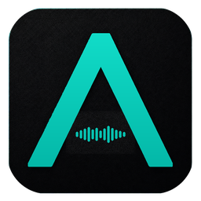
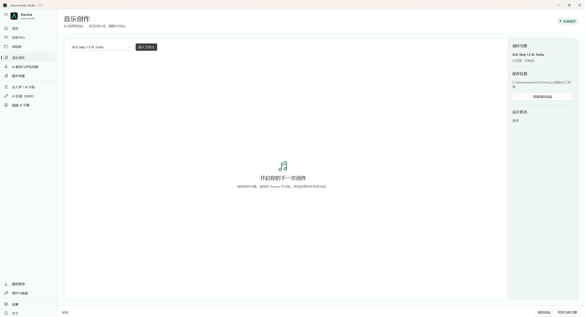

<div align="center">
  
  <h1>Aurora Audio Studio</h1>
  <p><strong>让声音创作，回到创作本身。</strong></p>
  <p>面向 Windows 的本地 AI 音频创作工作台</p>
  <p>
    <a href="https://swy2018.github.io/Aurora-Audio-Studio/">官方网站</a>
    · <a href="https://github.com/swy2018/Aurora-Audio-Studio/releases/latest">下载 1.1.0</a>
    · <a href="CHANGELOG.md">更新日志</a>
    · <a href="#english">English</a>
  </p>
</div>



Aurora 把音乐生成、AI 配音、声音克隆、歌声转换、音轨分离、MIDI 扒谱和视频字幕集中到同一个本地工作空间。模型、素材、任务、项目与成品关系清楚可见，不再需要手动管理多个启动器、端口和结果目录。

## 1.1 带来了什么

### 一条完整的本地创作流程

- 多选或拖入音频与视频素材，在提交前直接预览。
- 使用快速草稿、推荐质量和高质量三档处理预设。
- 在任务中心查看引擎实时进度、当前阶段、持续时间与持久日志。
- 暂停后续队列，不强行中断正在执行的本地任务。
- 在成品库集中查看音轨、MIDI、字幕和其他输出。

### 更可靠的模型部署

- 安装前显示准确目标目录、预计下载量、建议空间和当前可用磁盘空间。
- 显示下载进度与传输速度，支持取消和断点续传。
- 模型包执行 SHA-256 校验，新安装先完成临时目录完整性检查。
- 模型按需安装；默认工作流保持不变，可选引擎由用户自行决定。

### 更像产品，而不是工具集合

- `.arr` 项目保存素材、模型、参数、任务和成品关系。
- 旧 `.aurora` 项目继续兼容。
- 每天首次启动可自动检查应用更新，也可随时手动检查。
- 应用更新从 GitHub 获取安装包并验证 SHA-256，随后交给标准 Windows 安装界面覆盖升级。
- 界面支持简体中文、繁體中文、English 和日本語。

## 工作流

| 工作流 | 默认引擎 | 可选引擎 | 主要输出 |
|---|---|---|---|
| 音乐创作 | ACE-Step 1.5 XL Turbo | 后续按模型中心扩展 | 完整歌曲、纯音乐与草稿 |
| AI 配音与声音克隆 | Qwen3-TTS 1.7B | Qwen3-TTS 0.6B、F5-TTS | 配音与克隆音频 |
| 歌声克隆 | Seed-VC 44.1k | 按模型中心扩展 | 歌声与音色转换 |
| 去人声 / AI 分轨 | BS-RoFormer-SW 6-Stem | Demucs 4 | 独立 WAV 音轨 |
| AI 扒谱 | YourMT3+ | ByteDance Piano、Basic Pitch | 标准 MIDI |
| 视频 AI 字幕 | Faster-Whisper XXL | Small、Large v3 Turbo、Large v3 | SRT 与转写数据 |

模型与第三方工具保留各自上游许可。模型大小、显存建议、语言能力和来源会在模型中心逐项显示。

## 安装

### 系统要求

- Windows 10 或 Windows 11 x64
- 建议使用 NVIDIA RTX 显卡
- 模型根据实际工作流单独下载
- 大型模型安装前请预留模型中心建议的磁盘空间

### 标准安装

1. 打开 [Releases](https://github.com/swy2018/Aurora-Audio-Studio/releases/latest)。
2. 下载 `Aurora-Audio-Studio-1.1.0-Setup-x64.exe` 和同名 `.sha256` 文件。
3. 运行安装程序，阅读并接受 GNU GPL v3.0，选择安装位置和桌面快捷方式。
4. 首次打开 Aurora，在设置中确认模型、项目和成品目录。

默认安装位置是 `C:\Program Files\Aurora Audio Studio`。覆盖升级会保留用户设置、任务记录、模型、项目和成品；卸载时可选择是否清除个人配置。

## 数据与隐私

Aurora 本身不提供云端生成服务。素材与生成结果留在用户指定的本地目录。应用更新和模型部署会连接 GitHub、Hugging Face 或模型注明的官方来源。

- [隐私说明](PRIVACY.md)
- [代码签名政策](CODE_SIGNING_POLICY.md)
- [GNU GPL v3.0](LICENSE)

## 开发

Aurora 桌面端使用 .NET 10、WinUI 3 和 Windows App SDK 构建，官网使用原生 HTML、CSS 与 ES Modules，可直接部署到 GitHub Pages。

```powershell
dotnet restore .\work\audio-studio\AuroraAudioStudio\AuroraAudioStudio.csproj --runtime win-x64
dotnet build .\work\audio-studio\AuroraAudioStudio\AuroraAudioStudio.csproj -c Release -p:Platform=x64
dotnet publish .\work\audio-studio\AuroraAudioStudio\AuroraAudioStudio.csproj -c Release -r win-x64 --self-contained true -p:Platform=x64 -o .\publish\Aurora-Audio-Studio-1.1.0
```

运行回归检查：

```powershell
dotnet run --project .\work\audio-studio\AuroraAudioStudio.UpdateFlowTests\AuroraAudioStudio.UpdateFlowTests.csproj
```

## 项目结构

```text
docs/                                      官方网站
work/audio-studio/AuroraAudioStudio/       WinUI 3 桌面端
work/audio-studio/AuroraAudioStudio.iss    Inno Setup 安装脚本
model-manifest.json                        可验证模型更新清单
CHANGELOG.md                               中英双语更新日志
```

## 许可

Aurora Audio Studio 以 [GNU General Public License v3.0](LICENSE) 开源。模型、运行时和第三方组件遵循各自许可。

---

<a id="english"></a>

## English

Aurora Audio Studio is a local AI audio production workspace for Windows. It brings music generation, voice cloning, singing conversion, stem separation, MIDI transcription, and video subtitles into one coherent product where projects, tasks, models, and results remain connected.

### What version 1.1 adds

- Multi-select and drag-and-drop media intake with built-in audio and video preview.
- Fast, Recommended, and Quality presets for separation, transcription, and subtitles.
- Live engine progress, stage, elapsed time, and persistent logs in Task Center.
- Control over pending work without forcing the active local process to stop.
- A Results library for stems, MIDI, subtitles, and other output.
- Model disk-space checks, progress and transfer speed, cancellation, resume, checksum verification, and staged integrity checks.

### Local by design

Aurora does not operate a cloud generation service. Media and generated output remain in the directories chosen by the user. App updates and model deployment connect only to GitHub, Hugging Face, or the official source identified for each model.

### Install

1. Open the latest [Release](https://github.com/swy2018/Aurora-Audio-Studio/releases/latest).
2. Download `Aurora-Audio-Studio-1.1.0-Setup-x64.exe` and its `.sha256` file.
3. Run Setup, review GNU GPL v3.0, and choose the destination and shortcut options.
4. Confirm model, project, and output directories on first launch.

Aurora defaults to `C:\Program Files\Aurora Audio Studio`. In-place upgrades preserve settings, task history, models, projects, and output. Uninstall offers an optional personal-configuration cleanup.

### Technology

- .NET 10
- WinUI 3
- Windows App SDK
- Inno Setup
- Native HTML, CSS, and ES Modules for the website

Aurora Audio Studio is licensed under the [GNU General Public License v3.0](LICENSE). Models, runtimes, and third-party components retain their own licenses.
